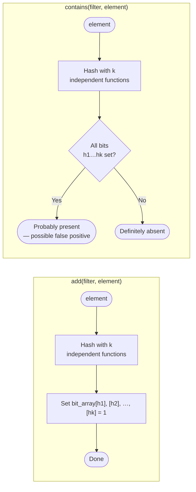

# ova-lib — Algorithm Flowcharts

All diagrams below use [Mermaid](https://mermaid.js.org/) syntax and are rendered
automatically by GitHub.

---

## 1. Binary Heap — `put` (insert)

```mermaid
flowchart TD
    A([Start: put item]) --> B{size == capacity?}
    B -- Yes --> C[Realloc array\n× 2 capacity]
    C --> D[Store item at data[++size]]
    B -- No  --> D
    D --> E[i = size]
    E --> F{i > 1 AND\ncmp(data[i], data[i/2]) > 0?}
    F -- Yes --> G[Swap data[i] and data[i/2]]
    G --> H[i = i / 2]
    H --> F
    F -- No  --> I([End: heap property restored])
```

---

## 2. Binary Heap — `pop` (extract-top)

```mermaid
flowchart TD
    A([Start: pop]) --> B{size == 0?}
    B -- Yes --> C([Return NULL])
    B -- No  --> D[Save top = data[1]]
    D --> E[data[1] = data[size--]]
    E --> F[i = 1]
    F --> G{Left child\n2i ≤ size?}
    G -- No  --> Z([Return top])
    G -- Yes --> H[largest = i\nCheck left child 2i]
    H --> I{Right child\n2i+1 ≤ size?}
    I -- Yes --> J[Compare children;\nlargest = larger child]
    I -- No  --> K
    J --> K{cmp(data[largest],\ndata[i]) > 0?}
    K -- No  --> Z
    K -- Yes --> L[Swap data[i] and\ndata[largest]]
    L --> M[i = largest]
    M --> G
```

---

## 3. Fibonacci Heap — `decrease_key`

```mermaid
flowchart TD
    A([Start: decrease_key\nnode, new_value]) --> B[Update node→key\nto new_value]
    B --> C[parent = node→parent]
    C --> D{parent != NULL AND\ncmp(node, parent) > 0?}
    D -- No  --> E{node == min_node OR\ncmp(node, min_node) > 0?}
    E -- Yes --> F[min_node = node]
    E -- No  --> G([End])
    F --> G
    D -- Yes --> H[cut(node, parent)]
    H --> I[Add node to root list]
    I --> J[node→mark = false]
    J --> K[cascading_cut(parent)]
    K --> L{parent→mark\n== false?}
    L -- No  --> M[parent→mark = true]
    M --> G
    L -- Yes --> N[cut(parent, parent→parent)]
    N --> O[Add parent to root list]
    O --> P[parent = parent→parent]
    P --> L
```

---

## 4. Hash Map — `put` (insert / update)

```mermaid
flowchart TD
    A([Start: put key, data]) --> T{Thread-safe\nmap?}
    T -- Yes --> TL[Acquire mutex lock]
    T -- No  --> B
    TL --> B
    B[Compute bucket = hash_func(key, capacity)]
    B --> C[head = buckets[bucket]]
    C --> D{head != NULL?}
    D -- Yes --> E{key_compare(head→key, key) == 0?}
    E -- Yes --> F[Update head→data = data]
    F --> UL{Thread-safe?}
    E -- No  --> G[head = head→next]
    G --> D
    D -- No  --> H[Allocate new map_entry]
    H --> I[entry→key = key\nentry→data = data\nentry→next = buckets[bucket]]
    I --> J[buckets[bucket] = entry\nsize++]
    J --> K{size / capacity\n> LOAD_FACTOR (0.75)?}
    K -- Yes --> L[Rehash: double capacity\nreallocate buckets\nre-insert all entries]
    L --> UL
    K -- No  --> UL
    UL -- Yes --> M[Release mutex]
    UL -- No  --> N([End])
    M --> N
```

---

## 5. Sorting — `sort` dispatch inside `sorter`

```mermaid
flowchart TD
    A([Start: sorter→sort(lst)]) --> B[Retrieve list size n]
    B --> C{n <= 1?}
    C -- Yes --> Z([Already sorted — return])
    C -- No  --> D[Quicksort: pick pivot\n= element at n/2]
    D --> E[Partition list around pivot\nusing sorter→cmp]
    E --> F[Recursively sort\nleft partition]
    F --> G[Recursively sort\nright partition]
    G --> H[Combine: in-place\nswap via sorter→swap]
    H --> Z
```

---

## 6. Graph — Dijkstra's Shortest Path

```mermaid
flowchart TD
    A([Start: dijkstra(g, src)]) --> B[Allocate dist[] = +∞\ndist[src] = 0]
    B --> C[Create priority queue\nwith comparator on dist]
    C --> D[Enqueue src with priority 0]
    D --> E{Queue empty?}
    E -- Yes --> F([Return dist[]])
    E -- No  --> G[u = dequeue minimum]
    G --> H[For each neighbour v of u]
    H --> I{dist[u] + w(u,v)\n< dist[v]?}
    I -- No  --> J{More neighbours?}
    J -- Yes --> H
    J -- No  --> E
    I -- Yes --> K[dist[v] = dist[u] + w(u,v)]
    K --> L[Enqueue v with\nnew priority]
    L --> J
```

---

## 7. Simplex Solver — `solve` overview

```mermaid
flowchart TD
    A([Start: solver→solve(problem)]) --> B{problem == NULL?}
    B -- Yes --> ERR([Return INFEASIBLE])
    B -- No  --> C{constraints or\nobjective == NULL?}
    C -- Yes --> ERR
    C -- No  --> D[Build initial simplex tableau\nfrom lp_problem matrices]
    D --> E{Optimal? All reduced\ncosts ≥ 0?}
    E -- Yes --> F[Extract solution\ninto problem→solution\nSet problem→z_value]
    F --> G([Return OPTIMAL])
    E -- No  --> H[Select entering variable\n(most negative reduced cost)]
    H --> I{Feasible pivot\nrow exists?}
    I -- No  --> UNB([Return UNBOUNDED])
    I -- Yes --> J[Perform pivot:\nrow reduce tableau]
    J --> E
```

---

## 8. Bloom Filter — `add` and `contains`


